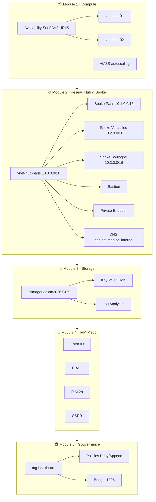

# az104-healthcare
Infrastructure Cloud complète secteur santé · AZ-104 + M365
# 🏥 az104-healthcare
> Infrastructure Cloud complète secteur santé · AZ-104 + M365 · Tiana Blaudet · 2026


---

## 📋 Description

Projet cloud complet simulant l'infrastructure Azure d'un cabinet médical multi-sites :
haute disponibilité, réseau Hub & Spoke sécurisé, stockage DICOM chiffré, identités et gouvernance.
Couvre l'intégralité des domaines AZ-104.

---

## 🏗️ Architecture globale


---

## 📦 Module 1 · Compute Haute Disponibilité
> Jour 1 & 2 — Labo Analyses Médicales

| Ressource | Configuration |
|-----------|--------------|
| Resource Group | `rg-labo-compute` · France Central |
| Availability Set | `as-labo-compute` · FD=2 · UD=5 |
| VM 1 | `vm-labo-01` · Ubuntu 22.04 · Standard_D2s_v3 |
| VM 2 | `vm-labo-02` · Ubuntu 22.04 · Standard_D2s_v3 |
| Backup | `rsv-labo-compute` · Quotidien 23h · Rétention 30j |
| VMSS | `vmss-labo-compute` · CPU>70% scale-out · CPU<30% scale-in |
| Bicep | `bicep/labo-compute.bicep` · az bicep decompile |

### ✅ Screenshots
- [ ] Availability Set — FD=2 et UD=5 visibles
- [ ] 2 VMs dans l'AS — statut Running
- [ ] Azure Backup — Protection activée
- [ ] VMSS règles autoscaling
- [ ] Cloud Shell — az bicep decompile exécuté

### ⭐ Points clés AZ-104
> - Availability Set ≠ Zone (même datacenter vs datacenter différent)
> - FD = rack physique · UD = fenêtre de maintenance
> - VMSS = autoscaling selon charge · Scale OUT = +VMs · Scale IN = -VMs
> - ARM = JSON déclaratif · Bicep = ARM simplifié

---

## 🌐 Module 2 · Réseau Sécurisé Cabinet Médical
> Jour 3 & 4 — Hub & Spoke · NSG · Bastion · DNS

| Ressource | Configuration |
|-----------|--------------|
| Hub | `vnet-hub-paris` · 10.0.0.0/16 |
| Spoke Paris | `vnet-spoke-paris` · 10.1.0.0/16 |
| Spoke Versailles | `vnet-spoke-versailles` · 10.2.0.0/16 |
| Spoke Boulogne | `vnet-spoke-boulogne` · 10.3.0.0/16 |
| NSG | Port 443 Allow · Port 1433 Allow · Deny All |
| Bastion | `bastion-hub-paris` · sans IP publique sur les VMs |
| Private Endpoint | `pe-cabinet-storage` · blob |
| DNS privé | `cabinet.medical.internal` · lié aux 4 VNets |

### ✅ Screenshots
- [ ] 4 VNets créés avec espaces d'adressage
- [ ] 3 peerings — statut Connecté
- [ ] NSG règles entrantes (443, 1433, Deny All)
- [ ] Azure Bastion déployé dans le Hub
- [ ] Private Endpoint — état Approuvé
- [ ] Zone DNS + liens VNets

### ⭐ Points clés AZ-104
> - Hub & Spoke = architecture centralisée
> - Peering non-transitif : Paris ne parle PAS directement à Versailles
> - NSG priorité = plus petit = prioritaire · Port 1433 = SQL Server
> - Bastion = accès SSH/RDP SANS IP publique sur les VMs

---

## 💾 Module 3 · Storage Imagerie Médicale
> Jour 5 & 6 — GRS · Lifecycle · CMK · SAS · KQL · Alertes

| Ressource | Configuration |
|-----------|--------------|
| Storage Account | `stimageriedicm2026` · GRS · France Central |
| Conteneur | `imagerie-medicale` · Accès privé |
| Lifecycle | Hot 30j → Cool 90j → Archive 1 an |
| Key Vault | `kv-imagerie-medical` · CMK RSA 2048 |
| SAS Token | User Delegation · Lecture+Liste · 24h |
| Log Analytics | `law-imagerie-medical` · Rétention 30j |
| Alerte | `alert-acces-ip-inconnue` · Action Group email |

### ✅ Screenshots
- [ ] Storage Account GRS + conteneur
- [ ] Lifecycle Hot→Cool→Archive
- [ ] Key Vault + clé CMK
- [ ] SAS Token généré
- [ ] Log Analytics connecté
- [ ] KQL résultats (5 requêtes)
- [ ] Alerte Azure Monitor

### 📊 Requêtes KQL — `kql/storage-queries.kql`

```kql
// 1. Toutes les opérations des dernières 24h
StorageBlobLogs
| where TimeGenerated > ago(24h)
| project TimeGenerated, OperationName, CallerIpAddress
| order by TimeGenerated desc

// 2. Top IP par volume
StorageBlobLogs
| summarize count() by CallerIpAddress
| order by count_ desc

// 3. Activité par heure
StorageBlobLogs
| summarize count() by bin(TimeGenerated, 1h)
| render timechart

// 4. Erreurs HTTP
StorageBlobLogs
| where tolong(StatusCode) > 399
| project TimeGenerated, StatusCode, OperationName, CallerIpAddress

// 5. Accès IP externes
StorageBlobLogs
| where CallerIpAddress !startswith "10."
| where CallerIpAddress !startswith "192.168."
| project TimeGenerated, CallerIpAddress, OperationName
```

### ⭐ Points clés AZ-104
> - GRS = réplication synchrone locale + asynchrone géographique
> - Lifecycle = automatise Hot → Cool → Archive selon l'âge du blob
> - CMK = clé gérée par le client (vs MMK = clé Microsoft)
> - SAS User Delegation = signé Entra ID, plus sécurisé

---

## 👥 Module 4 · IAM Clinique M365
> Entra ID · RBAC · PIM Just-In-Time · SSPR

| Ressource | Configuration |
|-----------|--------------|
| Groupes | `grp-medecins` · `grp-infirmiers` · `grp-it-clinique` · `grp-secretaires` |
| Utilisateurs | 8 users · 2 par groupe |
| RBAC | grp-medecins → Reader · grp-it-clinique → Contributor |
| PIM | grp-it-clinique · Owner éligible · 2h max |
| SSPR | 4 groupes · Email + Téléphone · 1 méthode |

### ✅ Screenshots
- [ ] 4 groupes Entra ID créés
- [ ] 8 utilisateurs assignés
- [ ] RBAC attributions par groupe
- [ ] PIM durée 2h configurée
- [ ] SSPR activé pour les 4 groupes

### ⭐ Points clés AZ-104
> - PIM = Just-In-Time · activation sur demande avec audit
> - RBAC = permission par rôle sur un scope
> - Principe du moindre privilège
> - SSPR = réinitialisation autonome sans IT

---

## 🏛️ Module 5 · Gouvernance Pharmacies M365
> Management Groups · Azure Policy · Cost Management

| Ressource | Configuration |
|-----------|--------------|
| MG Racine | `mg-healthcare` → Tenant Root Group |
| MG Enfants | `mg-pharmacie-paris` · `mg-pharmacie-lyon` · `mg-pharmacie-bordeaux` |
| Policy 1 | Allowed locations · France Central + France South · Deny |
| Policy 2 | Require tag · `environnement` · Append |
| Initiative | `initiative-healthcare` · 3 policies |
| Budget | `budget-healthcare-mensuel` · 100€ · Alertes 80% + 100% |

### ✅ Screenshots
- [ ] Hiérarchie Management Groups
- [ ] 2 policies + initiative assignées
- [ ] Budget 100€ avec alertes

### ⭐ Points clés AZ-104
> - MG = gouvernance multi-subscription · Policies héritées par les enfants
> - Policy Deny = bloque création · Policy Append = ajoute automatiquement
> - Initiative = ensemble de policies pour un objectif commun
> - Budget = alerte uniquement — N'ARRÊTE PAS les ressources

---

## 🎯 Compétences démontrées

| Domaine AZ-104 | Compétences |
|----------------|-------------|
| **Compute** | Availability Sets FD/UD, VMSS autoscaling, Azure Backup, Bicep/ARM |
| **Networking** | Hub & Spoke, VNet Peering, NSG, Bastion, Private Endpoint, DNS privé |
| **Storage** | GRS, Lifecycle Hot/Cool/Archive, Key Vault CMK, SAS User Delegation |
| **Monitoring** | Log Analytics, KQL (5 requêtes), Azure Monitor Alertes |
| **IAM** | Entra ID, RBAC granulaire, PIM Just-In-Time, SSPR |
| **Gouvernance** | Management Groups, Azure Policy Deny/Append, Initiative, Cost Management |

---

